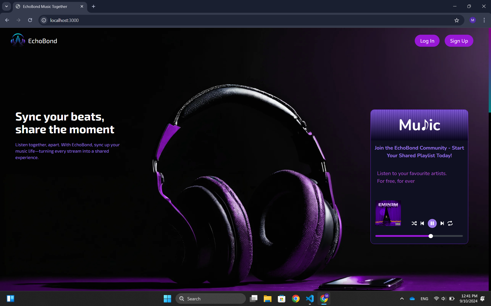
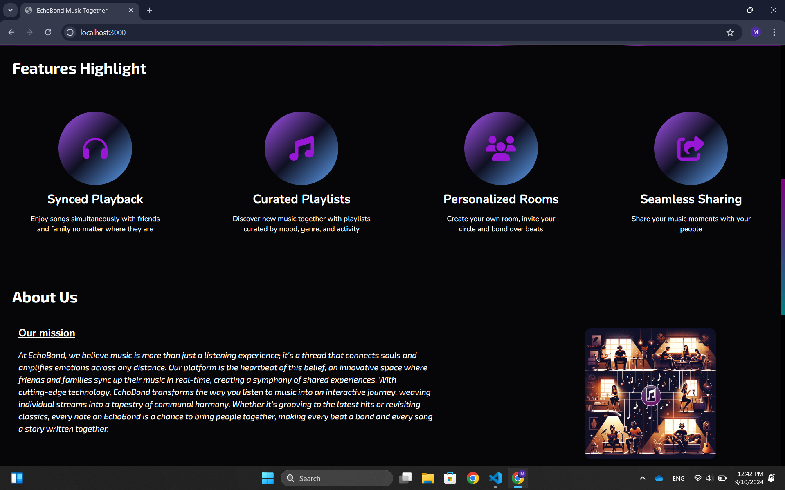
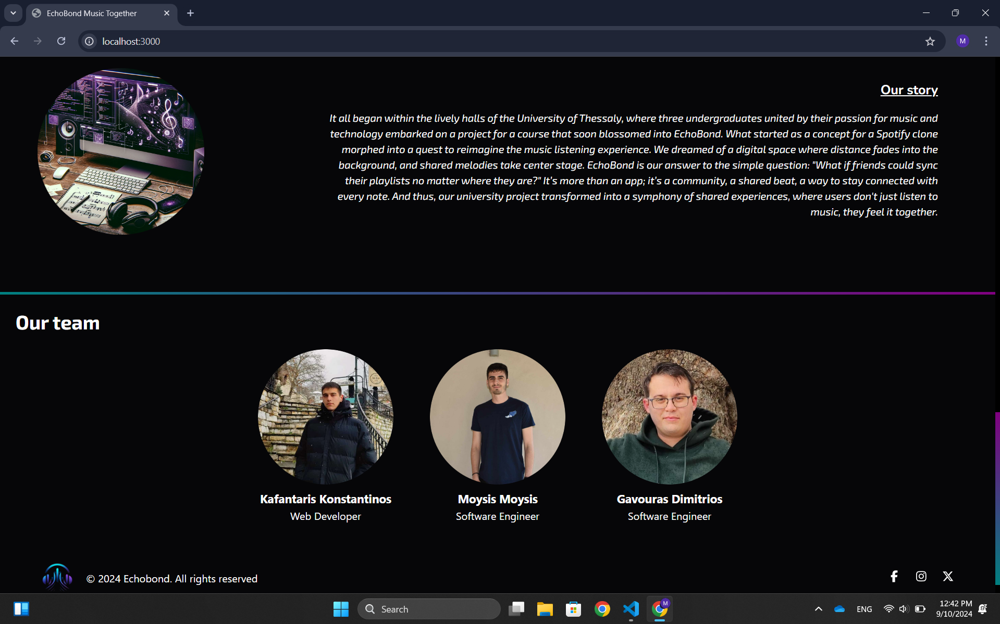
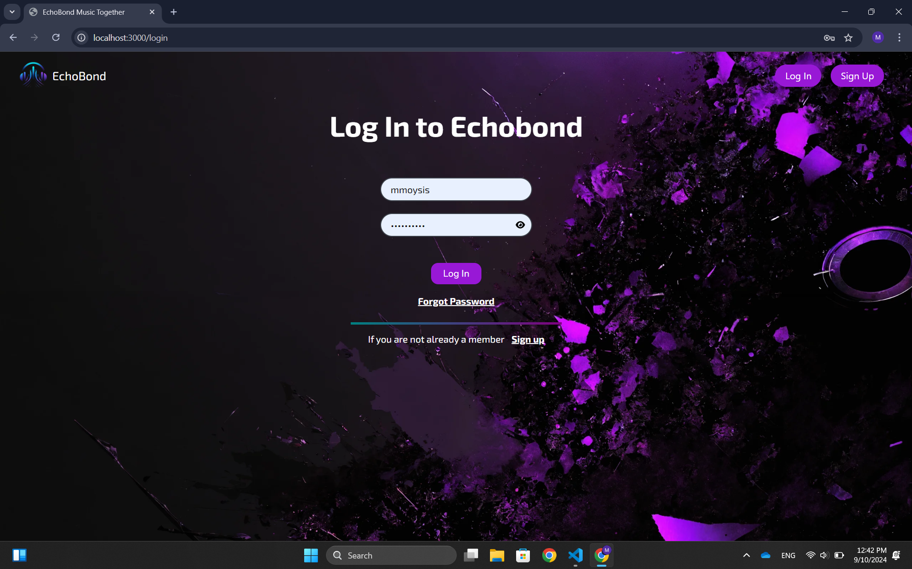
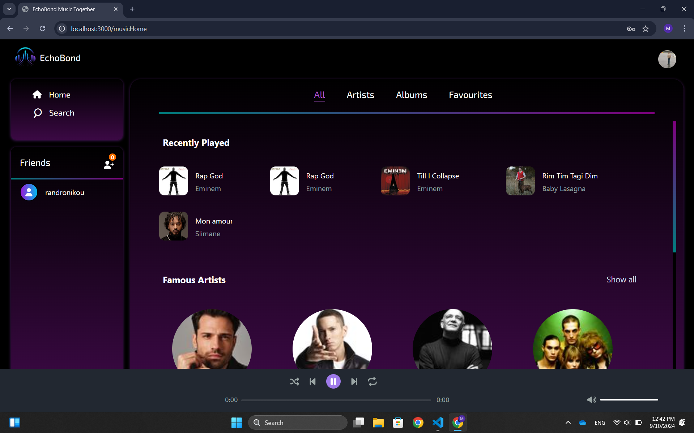
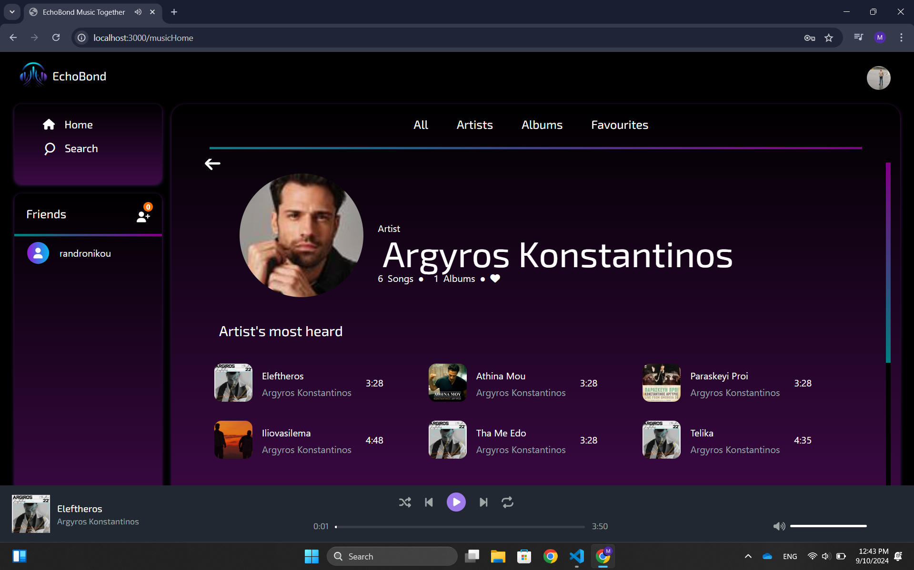
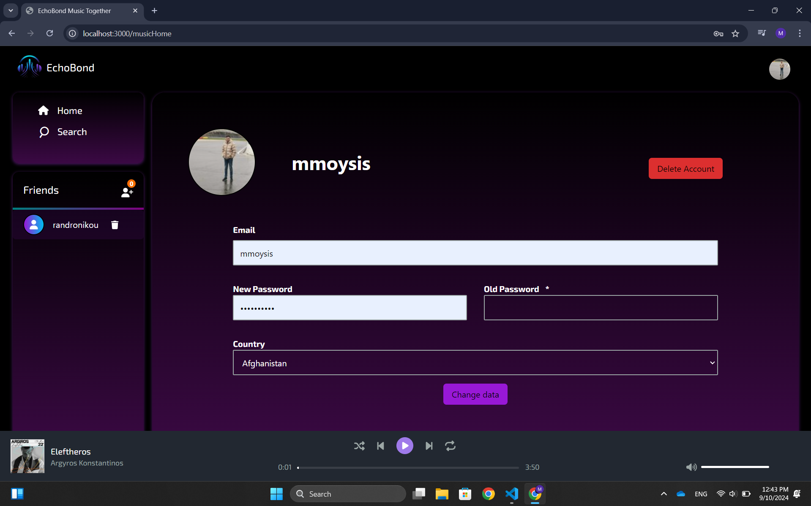
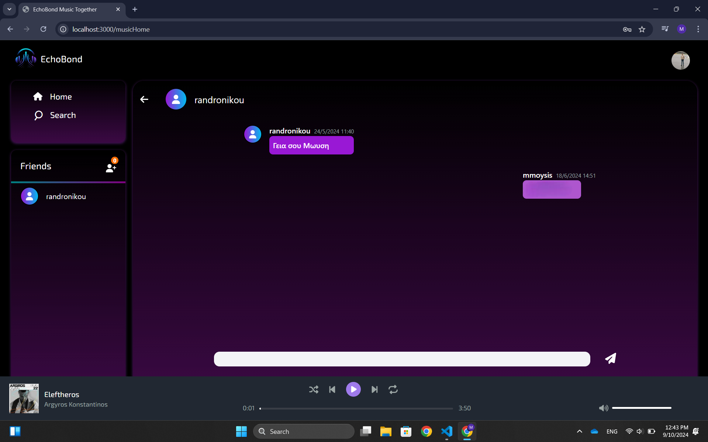

# Echobond Music Social Network

### A social platform for music lovers to connect, share, and bond over music.

## Table of Contents
- [Introduction](#introduction)
- [Features](#features)
- [Technology Stack](#technology-stack)
- [Installation](#installation)
- [Backend Details](#backend-details)
- [Usage](#usage)
- [App Photos](#app-photos)
- [Contributing](#contributing)
- [License](#license)

## Introduction

Echobond is a music-based social networking application that allows users to share their favorite songs, create playlists, and connect with other music enthusiasts. Whether you're a fan of pop, rock, or indie music, Echobond creates an environment for people to bond over music and discover new sounds together.

## Features
- **User Authentication**: Sign up and login functionality with enhanced security.
- **Social Networking**: Follow other users, send friend requests, and connect over similar music tastes.
- **Real-Time Messaging**: Chat with friends in real-time using WebSocket technology.
- **Music Playback and Control**: Listen to music, change songs in real-time using socket-based interactions.
- **Playlist Creation**: Build and share playlists with your followers.
- **Music Discovery**: Discover trending and new songs shared by other users.

## Technology Stack
### Client
- **React.js**: Frontend framework
- **Tailwind CSS**: For UI styling
- **Axios**: For HTTP requests

### Server
- **Node.js**: Backend framework
- **Express.js**: Web framework for Node.js
- **MongoDB**: Database for storing user data, songs, playlists, and friend requests
- **WebSocket**: For real-time chat and music interaction

## Installation

### Prerequisites
- **Node.js** (v14.x or higher)
- **npm** or **yarn**
- **MongoDB** (running locally or via MongoDB Atlas)

### Clone the repository
```bash
git clone https://github.com/MMoses12/Echobond-music-social-network-node-react.git
cd Echobond-Music-App
```

### Install Dependencies
For the **client**:
```bash
cd Client
npm install
```

For the **server**:
```bash
cd ../Server
npm install
```

### Environment Setup
Make sure to create a `.env` file in the `Server` directory with the following variables:
```bash
MONGO_URI=mongodb://localhost:27017/echobond
JWT_SECRET=your_jwt_secret
EMAIL_SERVICE_API_KEY=your_email_service_key
OTP_SECRET=your_otp_secret_key
```

### Running the Application

#### For Development
Run the **client**:
```bash
cd Client
npm start
```

Run the **server**:
```bash
cd ../Server
npm run dev
```

The client will run on `http://localhost:3000` and the server on `http://localhost:5000`.

## Backend Details

### Security Features
The Echobond backend is built with security in mind, utilizing several modern security practices to ensure user data is protected.

- **JWT (JSON Web Tokens)**: Used for securely transmitting information between the client and server. Each authenticated session issues a signed JWT that is validated for all subsequent requests.
  
- **Password Hashing**: User passwords are hashed using `bcrypt` to ensure they are securely stored and are never saved in plain text in the database.

- **Email Verification with OTP**: When a user registers, an OTP (One Time Password) is sent to their email for verification. The OTP is time-sensitive and ensures that only valid users can complete the sign-up process.

- **Friend Requests & Real-Time Messaging**: Users can send and accept friend requests to create their social circle. Once connected, users can chat with their friends in real-time using WebSocket-powered messaging.

- **Sockets for Music Playback**: Sockets are also used to facilitate real-time music listening, allowing users to change songs and listen together seamlessly.

### OTP Functionality
- **How it works**: 
  1. Upon registration or password reset, the system generates an OTP.
  2. This OTP is sent to the user's registered email address via an email service (e.g., SendGrid or another API).
  3. The OTP is valid for a limited time (e.g., 5 minutes), after which it expires.
  4. The user must input the OTP to verify their identity, completing the registration or allowing a password reset.

- **Configuration**: The OTP feature is powered by the `OTP_SECRET` environment variable, which is used to generate and validate the OTP. The expiration time and other configurations can be adjusted within the backend.

### WebSocket for Real-Time Messaging and Music Playback
The backend uses WebSocket to provide real-time updates to users, whether for messaging, notifications, or live music interaction.

- **Real-Time Messaging**: After users connect as friends, they can use the built-in chat feature to communicate instantly. This is powered by WebSocket, ensuring that messages are delivered without delay.
  
- **Real-Time Music Playback**: Users can listen to music and change songs in real-time using WebSocket. This feature allows seamless music sharing and interaction between users.

## Usage

1. **Sign up** for an account.
2. **Verify your account** using the OTP sent to your email.
3. **Create your profile** by adding favorite genres, songs, or albums.
4. **Send friend requests** and connect with other users.
5. **Chat with friends in real-time** using the WebSocket-powered chat feature.
6. **Listen to music and change songs in real-time** with your friends.
7. **Create and share playlists** with your followers.
8. **Discover new music** shared by the community.

## App Photos

Here are some screenshots of the Echobond Music App:

### Home Page







### LogIn


### Music Player




### User Page


### Chat


> Make sure to replace `assets/homepage-screenshot.png`, `assets/music-player-screenshot.png`, and `assets/chat-screenshot.png` with the actual paths to your images in the repository.

## License

This project is licensed under the MIT License - see the [LICENSE](LICENSE) file for details.